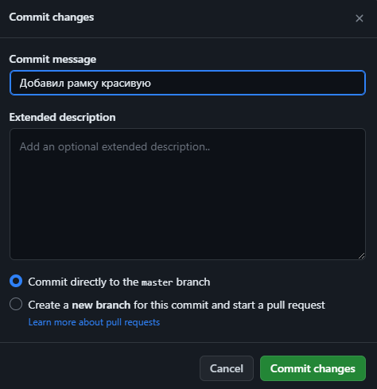
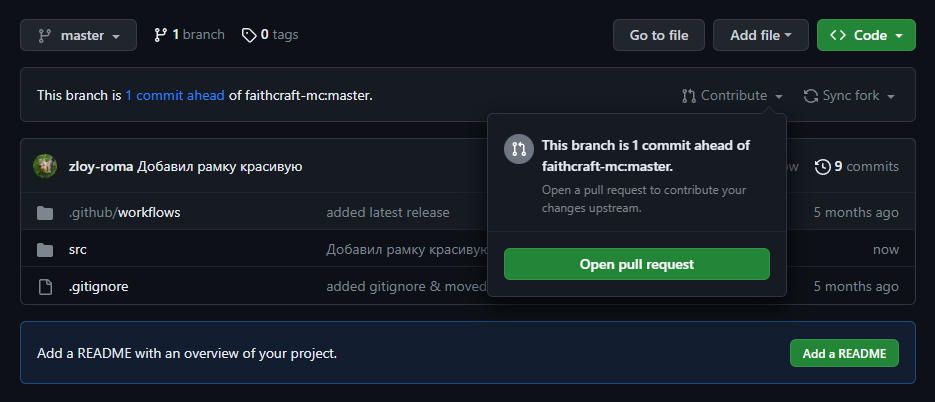

# Для работы ресурспака необходим мод [CitResewn](https://modrinth.com/mod/cit-resewn/versions)

## Заголовок

### Как обновить ресурспак или добавить туда что-то:

- Создаём форк репозитория с любым названием.

  

- Делаем какие-то изменения с помощью веб интерфейса github, или других программ.

- Создаём коммит (или несколько), пишем описание (что добавлено).

  

  

- Создаём `Pull Request` (`contribute -> open pull request`), заполняем общее описание всего что было добавлено. И
  нажимаем `Create pull request`.

  

  

- После проверки и одобрения `pull request` будет закрыт, а в ресурспак добавлены ваши правки 🥳
