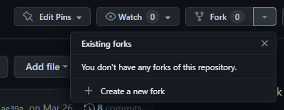
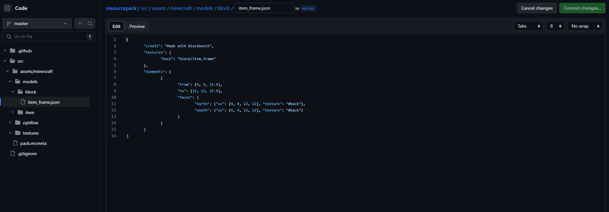
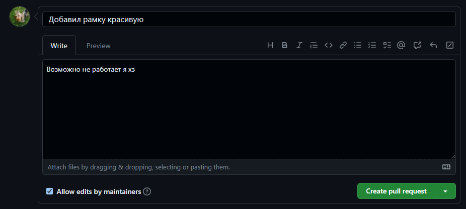

## Как обновить ресурспак или добавить туда что-то:

- Создаём форк репозитория с любым названием
  
- Делаем какие-то изменения с помощью веб интерфейса github, или других программ\
  
- Создаём коммит (или несколько), пишем описание (что добавлено). *Если не писать описание или написать какую-то билиберду, то время рассмотрения будет увеличено* \
   
  \
  
- Создаём `Pull Request` (`contribute -> open pull request`). Заполняем общее описание всего что было добавлено. И нажимаем `Create pull request` \
  
  \
  
- После проверки и одобрения `pull request` будет закрыт, а в ресурспак добавлены ваши правки 🥳